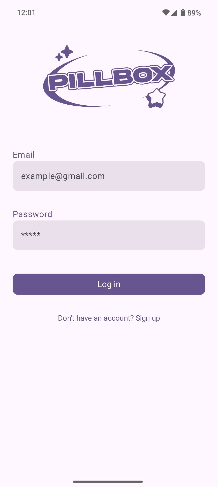
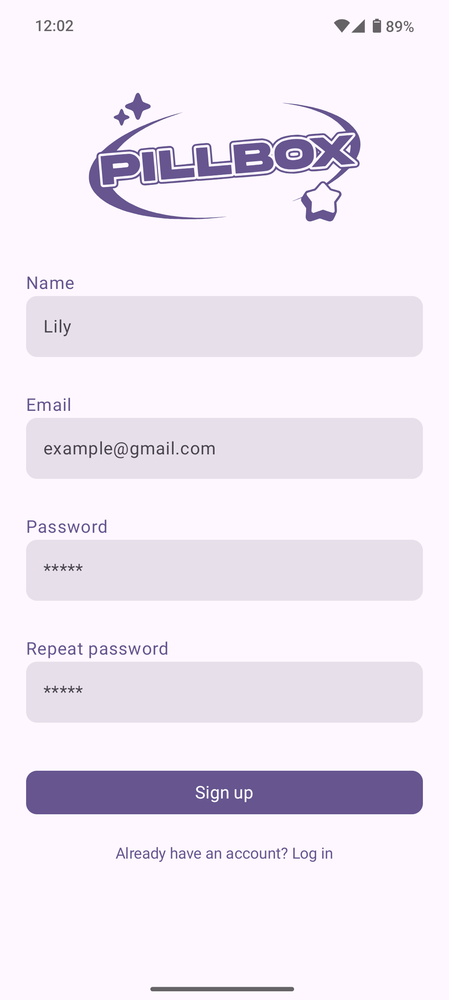
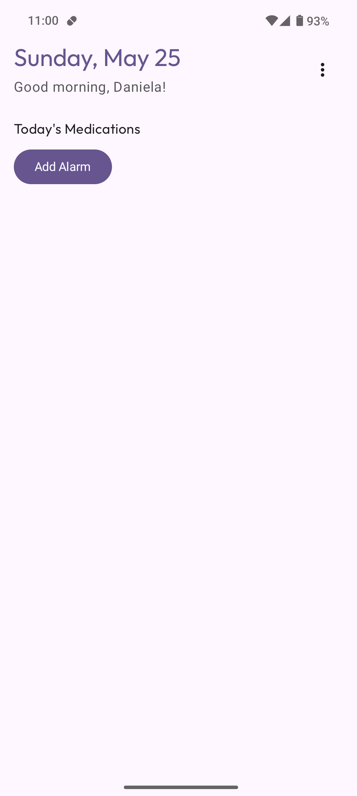
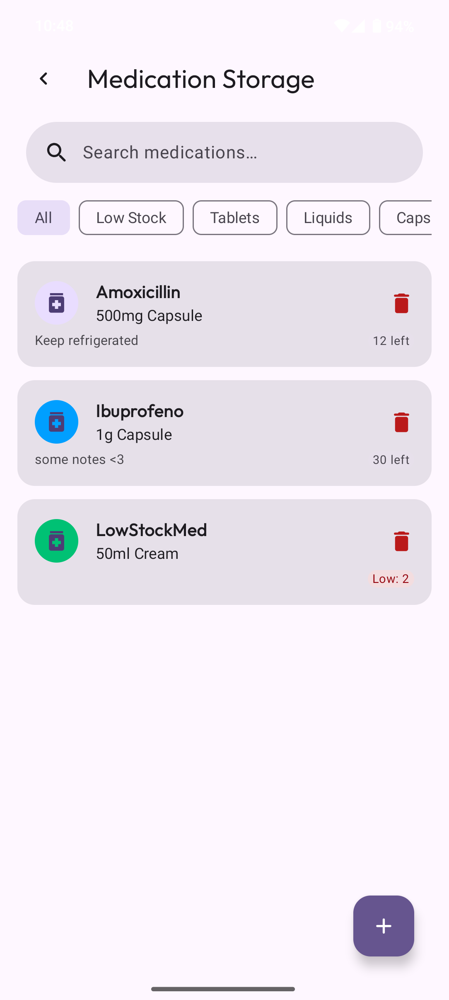
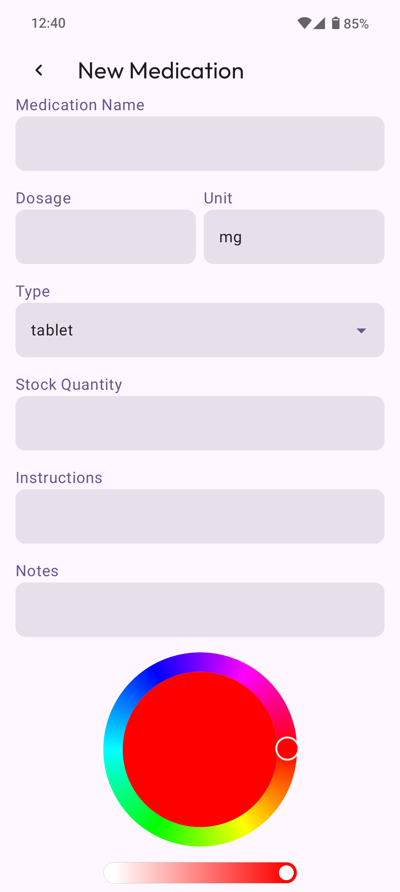
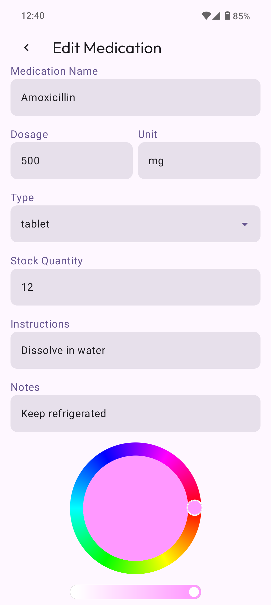
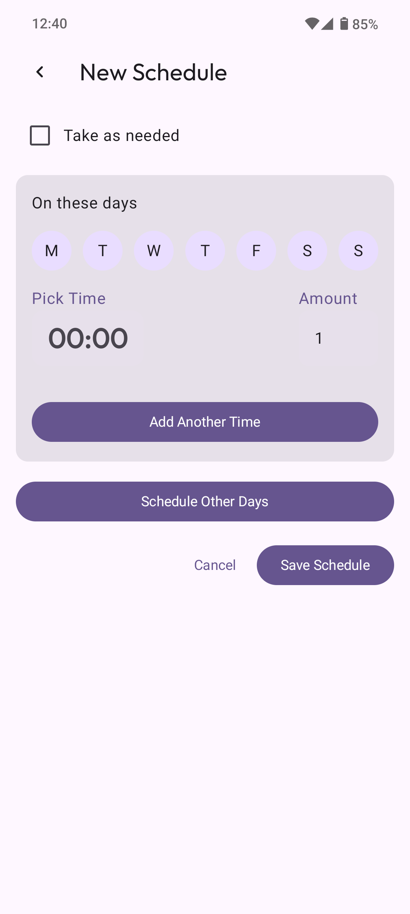
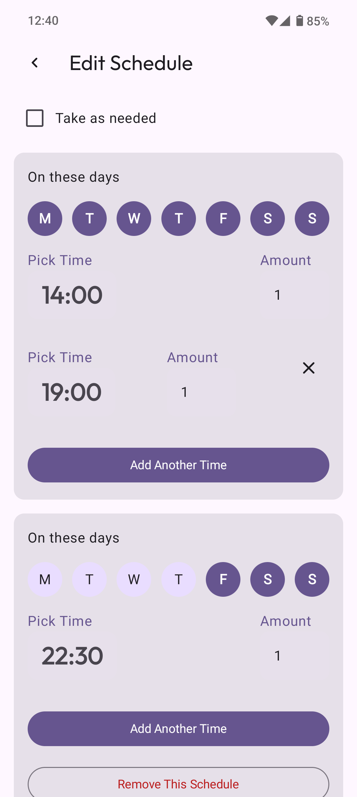
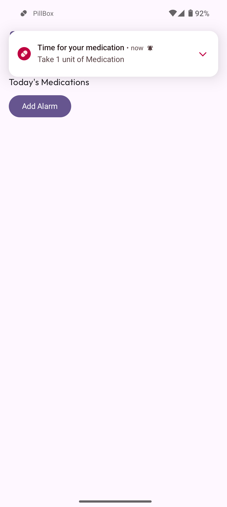

<div align="center">

<div style="display: flex; align-items: center; justify-content: center; gap: 20px;">
  
  <h1 style="margin: 0; font-size: 35px;">Enhancing Medication  with Technology</h1>
</div>

<div style="max-width: 700px;margin: 0 auto;padding: 20px;text-align: center;">
    Developed as my capstone project, <b>PillBox</b> reimagines medication tracking with intuitive design 
    and reliable technology. This documentation covers the development process, innovative features, 
    technical implementation, and how to get started with the app.
</div>

</div>

## Table of Contents

1. [✨ Features](#-features)
2. [🚀 Technologies](#-technologies)
3. [⚡ Installation](#-installation-process)
    - 3.1 [Official Releases 🛍](#-official-release-channels)
        - [Via F-Droid](#via-f-droid)
    - 3.2 [Building from Source 📦](#-building-from-source)
        - [Android Studio](#option-1-using-android-studio)
        - [Command Line](#option-2-command-line-with-gradle)
4. [💡 Challenges](#-challenges)
5. [📸 Screenshots](#-screenshots--mockups)
6. [🎯 Conclusion](#-wrapping-it-up)

## ✨ Features

[▲ Back to top](#-table-of-contents)

### 🔑 1. **User Authentication**

- Secure registration using email addresses.

### ✖️ 2. **Medication Tracking**

- Add, edit, delete, and track medications with details such as dosage, type, instructions, and
  stock levels.
- Color coding system for quick visual identification of medications.

### 🕒️ 3. **Scheduling System**

- Create detailed schedules with days/times and medication amounts (including "as needed").

### 🔔 4. **Reminders**

- Set precise alarms for medication times.

### 🔍 5. **Search & Filter**

- Search functionality by medication name or type with options to filter based on stock levels.
- Low-stock indicators help users prioritize medications accordingly.

## 📝 Technologies

[▲ Back to top](#-table-of-contents)

The app was built using:

- **Kotlin**: Primary programming language for logic and interactivity.
- **Jetpack Compose**: UI toolkit for building user interfaces.
- **Voyager**: Navigation library for app navigation.
- **Koin**: Dependency injection library to manage dependencies effectively.
- **Appwrite**: Backend-as-a-service for user authentication and database management.
- **Git & GitHub**: Version control system to manage code changes efficiently.

## ⚡️ Installation Process

[▲ Back to top](#-table-of-contents)

### 🧾 Official Release Channels

<div align="center">
  <a href="https://f-droid.org/packages/com.daniela.pillbox">
    
  </a>
  <!-- You can add Google Play badge here when available -->
</div>

#### Via F-Droid

1. **Enable F-Droid** (if not already installed):
    - Download from [f-droid.org](https://f-droid.org)
    - Allow installation from unknown sources

2. **Install PillBox**:
    - Search for "PillBox" in F-Droid
    - Tap "Install"
    - Grant required permissions

### 📦 Building from Source

#### ▸ **Option 1: Using Android Studio**

```bash
# 1. Grab the code
git clone https://github.com/LaDaniWapa/PillBox
cd PillBox

# 2. Open in Android Studio
#    - File > Open > Select that shiny new PillBox folder
#    - Grab coffee while Gradle does its sync dance (3-5 min)

# 3. Set up your secret handshake with AppWrite (don't skip this!)
#    - Wait for Gradle sync to complete (may take several minutes)
#    - Create a file called "secrets.properties" in the root of the project
#    - DON'T FORGET to add it to your .gitignore file!
#
#    - Fill it with the info from your appwrite project dashboard
#         APPWRITE_ENDPOINT=<your_appwrite_endpoint>
#         APPWRITE_PROJECT_ID=<your_appwrite_project_id>
#         APPWRITE_DATABASE_ID=<your_appwrite_database_id>
#         APPWRITE_MEDICATIONS_ID=<your_appwrite_medications_collection_id>
#         APPWRITE_SCHEDULES_ID=<your_appwrite_schedules_collection_id>
#         APPWRITE_INTAKES_ID=<your_appwrite_schedules_collection_id>

# 4. Double-check your tools:
#    - JDK 11+ (File > Project Structure > SDK Location)
#    - Android SDK 29+ (SDK Manager)

# 5. Hit the big green 'Run' button and pick your device!
```

#### ▸ **Option 2: Command Line with Gradle**

```bash
# 1. Grab the code
git clone https://github.com/LaDaniWapa/PillBox
cd PillBox

# 2. Set up your secret handshake with AppWrite (don't skip this!)
echo "secrets.properties" >> .gitignore  # Keep your secrets safe!
cat > secrets.properties <<EOF
APPWRITE_ENDPOINT=<your_appwrite_endpoint>
APPWRITE_PROJECT_ID=<your_appwrite_project_id>
APPWRITE_DATABASE_ID=<your_appwrite_database_id>
APPWRITE_MEDICATIONS_ID=<your_appwrite_medications_collection_id>
APPWRITE_SCHEDULES_ID=<your_appwrite_schedules_collection_id>
APPWRITE_INTAKES_ID=<your_appwrite_schedules_collection_id>
EOF

# 3. Build the debug APK (for testing)
./gradlew assembleDebug
# Output: app/build/outputs/apk/debug/app-debug.apk

# 4. Want it on your phone right now?
./gradlew installDebug

# 5. For release builds (when you're feeling official)
./gradlew assembleRelease  # Requires signing config
```

## Challenges 💡

[▲ Back to top](#-table-of-contents)

- **Setting up AppWrite**: Making everything work with your own server is quite complicated.
- **MVVM**: Girl I was going crazy at first, but now I can't live without it, thanks to Koin for
  making things easier <3
- **Schedules**: This CRUD was quite hard, I got lost several times, but my super nenas notebook is
  still
  my best friend.
- **Notification System**: I had no idea how to code it, but after some tutorials I managed to.

## 📸 Screenshots & App Flow

[▲ Back to top](#-table-of-contents)

<div align="center" style="width: 100%; overflow-x: auto;">

### 🔐 Authentication

|                                                                                                                                                                        |                                                                                                                                                                                         |
|------------------------------------------------------------------------------------------------------------------------------------------------------------------------|-----------------------------------------------------------------------------------------------------------------------------------------------------------------------------------------|
|  <br> *Login Screen* |  <br> *Registration Screen* |

### 🏠 Core Features

|                                                                                                                                                                           |                                                                                                                                                                                        |
|---------------------------------------------------------------------------------------------------------------------------------------------------------------------------|----------------------------------------------------------------------------------------------------------------------------------------------------------------------------------------|
|  <br> *Home Dashboard* |  <br> *Medication Inventory* |

### 💊 Medication Management

|                                                                                                                                                                                         |                                                                                                                                                                                        |
|-----------------------------------------------------------------------------------------------------------------------------------------------------------------------------------------|----------------------------------------------------------------------------------------------------------------------------------------------------------------------------------------|
|  <br> *Add New Medication* |  <br> *Edit Medication* |

### ⏰ Scheduling System

|                                                                                                                                                                                         |                                                                                                                                                                                       |
|-----------------------------------------------------------------------------------------------------------------------------------------------------------------------------------------|---------------------------------------------------------------------------------------------------------------------------------------------------------------------------------------|
|  <br> *Create New Schedule* |  <br> *Manage Schedules* |

### 🔔 Notifications



*Medication Reminder Notification*

</div>

## Wrapping It Up 🎯

[▲ Back to top](#-table-of-contents)

PillBox is like having a personal meds assistant in your pocket! 💊📱 We've packed it with all the
smart features you may need:

- **🔔 Friendly pings** - Tidy notifications to keep you on track
- **🔍 Quick-find meds** - Search works like magic when you're in a hurry
- **🎨 Colorful organization** - Because pills shouldn't be boring
- **🌎 Works in English & Spanish** — porque las pastillas no entienden de idiomas

<br>

<div align="center"> <em>Developed with 💖 for your health</em> </div>
